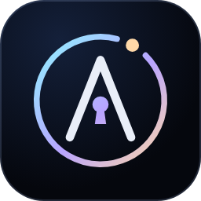

# Andy

Your personal CA and expense guardian: a Windows app that tracks every rupee from your bank, card
and UPI alert emails, day by day, month by month and year by year. It shows where you can spend
less, keeps your tax status, and has you approve anything Donna wants to spend. It runs only on your
PC, and your data never leaves it. See [SECURITY.md](SECURITY.md) for how it's protected.

<p align="center"></p>

## Install (once)

1. Install 64-bit **Python 3.12 or 3.13** from python.org and tick "Add python.exe to PATH".
2. Clone this repository:
   `git clone https://github.com/shrey1077/Shrey.git`
3. In that folder, run:
   `powershell -ExecutionPolicy Bypass -File andy\install-andy.ps1`
4. Open **Andy** from the Start menu or the desktop.

## First start

1. **Seal your vault.** Choose a passphrase of 12+ characters (a sentence works well).
2. **Write down the recovery code** on paper. It's shown once, and it's the only way back in if you
   forget the passphrase or move to a new PC.
3. **Answer a few questions** about you, your income, monthly commitments, safety net, taxes,
   budgets and goals. Everything you enter lands in **My info**, where you can edit it any time.
4. **Connect Gmail** (optional, and you can do it later):
   1. Turn on 2-Step Verification for your Google account.
   2. Create an app password named "Andy" at myaccount.google.com/apppasswords.
   3. Paste the 16 letters into Andy.

   Andy reads only alert emails and never sends, moves or deletes anything. If your bank doesn't
   email you for every UPI or card transaction, turn on email alerts in its net banking.

## Everyday use

- **Overview:** this month's spending against your budget, the month-end forecast, the last 30
  days day by day, where the money went, and Andy's top suggestions.
- **Expenses:** switch between Day, Month and Year, and tap any bar to drill in. Tap a transaction
  to recategorise it (and tell Andy to remember that merchant), add a note, leave it out of the
  totals, or delete it. "Add expense" covers cash.
- **Insights:** concrete ways to spend less, each with a rupee estimate and the assumption behind
  it. It covers subscriptions and streaming overlap, food-delivery habits, small daily spends,
  late-night impulse buys, weekend splurges, spikes against your usual, fees and penalties, budget
  overruns and your savings rate.
- **Approvals:** requests from Donna. You approve or reject each one, and anything above ₹5,000
  needs your passphrase.
- **Tax:** your FY 2025-26 return status, an old-vs-new regime estimate for this year, and upcoming
  deadlines.
- **Security:** auto-lock, approval threshold, Donna pairing, passphrase change and the activity log.

## Donna

Donna, your other AI assistant, talks to Andy through encrypted files on this PC, with no network
involved.

1. In Andy, go to **Security → Pair with Donna** and enter your passphrase. Andy shows a pairing key
   once.
2. Give that key to Donna as the environment variable `ANDY_DONNA_PAIRING` on this PC.
3. Donna can then:
   ```
   python -m andy.donna_client expense --amount 1499 --payee "Cult.fit" --purpose "Monthly gym" --due 2026-10-20
   python -m andy.donna_client summary --period this_month --reason "Planning the weekend"
   python -m andy.donna_client responses
   ```

Donna can only ask. Requests wait in **Approvals** until you decide. A summary is shared only after
you see exactly what it contains and approve it. Andy never makes payments.

## UPI

Andy can't connect to UPI directly, and nothing should. NPCI gives UPI access only to licensed banks
and payment apps, and there's no personal API to read your history or make payments. India's
Account Aggregator network can share bank statements, but only through RBI-licensed companies.
Instead:

- **Tracking:** your bank emails an alert for every UPI payment, and Andy reads those. This covers
  GPay, PhonePe, Paytm and every other UPI app, because the alert comes from the bank, not the app.
- **Paying:** when you approve something, you pay it in your UPI app with your PIN as usual. Your
  PIN stays the final lock, and Andy never holds anything that can move money.

## Backups and moving to a new PC

Andy keeps your data only in `%LOCALAPPDATA%\Andy\vault.andy`, plus the previous version in
`vault.bak`. To move to a new PC:

1. Copy `vault.andy` to `%LOCALAPPDATA%\Andy\` on the new machine.
2. Open Andy and choose "Use your recovery code".

The file alone is useless without the recovery code, so it's safe to keep a copy of it on a USB
drive.

## For developers

- Tests: `python3 -m unittest discover -s tests` (they run in development mode with throwaway data).
- Development on a non-Windows machine: `ANDY_DEV=1 python -m andy`. This weakens the device
  binding, so use test data only.
